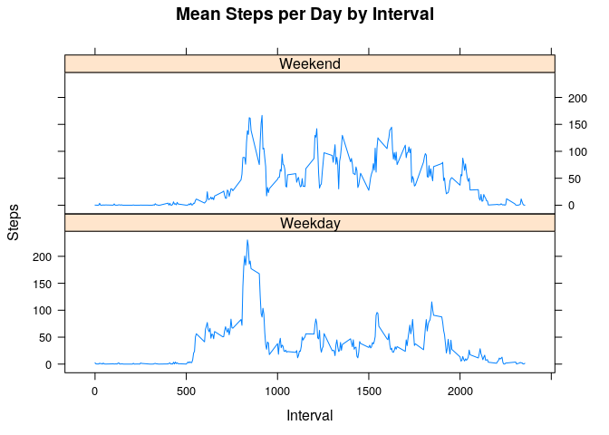

# Activity Patterns
Nicolas Moreno  
May 28, 2017  


## Loading and preprocessing the data

The data consists of two months of data from an anonymous individual collected during the months of October and November, 2012 and include the number of steps taken in 5 minute intervals each day.


```r
setwd("~/Desktop/DataScience/RepData_PeerAssessment1/")
if(!file.exists("activity.csv")){
system("unzip activity.zip")
}
activity <- read.csv("activity.csv")
library(dplyr)
library(ggplot2)
library(lattice)
library(lubridate)
```

## Mean total number of steps per day


```r
totalsteps <- aggregate(steps ~ date, data = activity, FUN = sum, na.rm = TRUE)
totalstepsmean <- round(mean(totalsteps$steps),2)
totalstepsmedian <- median(totalsteps$steps)
```


```r
ggplot(data=totalsteps, aes(steps)) +
  geom_histogram(breaks=seq(0,25000,by=5000)) 
```

<!-- -->

The mean total number of steps is 10766.19 and the median is 10765.

## Average daily activity pattern 


```r
totalstepsinterval <- aggregate(steps ~ interval, data=activity, FUN = mean)
maxinterval <- totalstepsinterval[which.max(totalstepsinterval$steps),]
plot(totalstepsinterval$interval,totalstepsinterval$steps, type="l", xlab="Interval", ylab="Steps",main="Mean Steps per Day by Interval")
```

<!-- -->

On average across all the days in the dataset, the maximum number of steps is 206.17 and correspond to interval 835.

## Imputing missing values


```r
naNumber <- sum(!complete.cases(activity))
```

There are 2304 missing values in the data set. The missing values are going to be filled with the mean of the corresponding 5 minute interval.


```r
impute.mean <- function(x) replace(x, is.na(x), mean(x, na.rm = TRUE))
activity$stepsisna <- is.na(activity$steps)
activity %>%
    group_by(interval) %>%
    mutate(steps = impute.mean(steps)) -> activityNoNAs
```


```r
totalstepsNoNas <- aggregate(steps ~ date, data = activityNoNAs, FUN = sum, na.rm = TRUE)
totalstepsmeanNoNas <- round(mean(totalstepsNoNas$steps),2)
totalstepsmedianNoNas <- round(median(totalstepsNoNas$steps),3)
totalstepsNoNas$imputed <- "Imputed data"
totalsteps$imputed <- "Original Data"
bindedsteps <- rbind(totalstepsNoNas, totalsteps)
```


```r
ggplot(data=bindedsteps, aes(steps, fill=imputed)) +
  geom_histogram(breaks=seq(0,25000,by=5000)) +
  facet_grid(. ~ imputed) +
  theme(legend.position = 'none')
```

<!-- -->

The mean total number of steps for the activity data after replacement of NAs is 10766.19 and the median is 10766.189. The difference is very small when compared with the values from the original data. The mean doesn't change, and the median has a small change. The new median is now almost identical to the mean. This could be due to the fact that I use means for intervals, thus get more data points quite similar or identical to the mean, and so the median is so shifted to become almost equal to the mean. Probably it would be different if I had used the daily mean or some other strategy to fill the NA values. 

## Are there differences in activity patterns between weekdays and weekends?


```r
activityNoNAs$dayName <- wday(activityNoNAs$date, label = TRUE)
activityNoNAs$dayType <- ifelse(activityNoNAs$dayName%in%c("Sat","Sun"), "Weekend", "Weekday")

meanstepsWeekday <- aggregate(steps ~ interval + dayType, activityNoNAs, mean)

xyplot(meanstepsWeekday$steps ~ meanstepsWeekday$interval|meanstepsWeekday$dayType, main="Mean Steps per Day by Interval",xlab="Interval", ylab="Steps",layout=c(1,2), type="l")
```

<!-- -->

The plot shows that there's a peak of activity (steps) early during weekdays. However overall there is more activity during weekends. 


